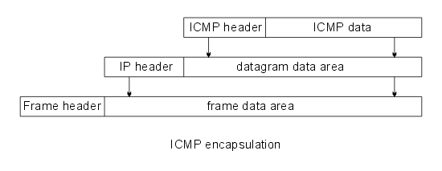
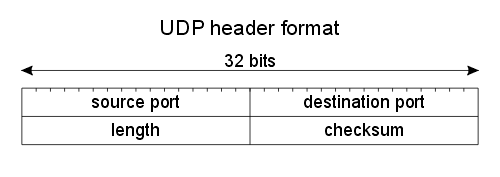

#
```
Markdown文件
https://markdown.tw/
```
# 
```
Network Types: LAN, WAN, PAN, CAN, MAN, SAN, WLAN
https://www.youtube.com/watch?v=4_zSIXb7tLQ
```
```
Network Topologies (Star, Bus, Ring, Mesh, Ad hoc, Infrastructure, & Wireless Mesh Topology)
https://www.youtube.com/watch?v=zbqrNg4C98U
```

```
What is a DMZ? (Demilitarized Zone)
https://www.youtube.com/watch?v=dqlzQXo1wqo

DMZ(非軍事化區域)用於提高安全性。
把公司的伺服器架設在第一層和第二層防火牆的中間，使駭客無法輕易的進入伺服器及公司內部的電腦網路。
```
```
NAT Explained(解釋) - Network Address Translation(網路地址轉換)
https://www.youtube.com/watch?v=FTUV0t6JaDA

NAT(網路地址轉換)這是路由器使用的服務。
私有IP地址通過路由器的NAT轉換成公用IP地址。

public to private(從公用的到私人的)
private to public(從私人的到公用的)

公用IP在Internet上公開註冊，所以可以直接連上網路，但數量有限，則私有IP地址未公開註冊，不能直接連上網路。
為了防止公用IP短缺，又要能省錢的使用公用IP，所以，在家中或辦公室使用路由器的NAT服務。
```
# 網路硬體

```
Layer-1:repeater(1-1), hub(1-N)
Layer-2:bridgr, switch
Layer-3: router,L3-Switch
Layer-4: L4 switch
Layer-7: L7 switch, proxy
```

# 網路協定:

## 必考問答題: Protocol(協定)
```
定義資料格式、編碼機制、錯誤處理，以及資料在網路上傳輸的順序。
```

### 名詞解釋題:NFC RFID

```
近距離無線通訊（英語：Near-field communication，NFC），又簡稱近距離通訊或近場通訊，是一套通訊協定，
讓兩個電子裝置（其中一個通常是行動裝置，例如智慧型手機）在相距幾公分之內進行通訊。
例:手機付款、信用卡
```
```
無線射頻辨識（英語：Radio Frequency IDentification，縮寫：RFID）是一種無線通訊技術，
可以通過無線電訊號識別特定目標並讀寫相關數據，而無需識別系統與特定目標之間建立機械或者光學接觸。
例:收費站、一卡通
```

# 網路協定:

### OSI MODEL
```
OSI Model Explained | OSI Animation | Open System Interconnection Model | OSI 7 layers | TechTerms
https://www.youtube.com/watch?v=vv4y_uOneC0

7	應用層(App的溝通介面，接收及傳送資料)
application layer	例如HTTP、SMTP、SNMP、FTP、Telnet、SIP、SSH、NFS、RTSP、XMPP、Whois、ENRP、TLS
6	表現層(加密及解密、壓縮及解壓縮、編碼及解碼)
presentation layer	例如XDR、ASN.1、SMB、AFP、NCP
5	會議層
session layer	例如ASAP、ISO 8327 / CCITT X.225、RPC、NetBIOS、ASP、IGMP、Winsock、BSD sockets
4	傳輸層
transport layer	例如TCP、UDP、RTP、SCTP、SPX、ATP、IL
3	網路層(決定資料的傳輸路徑)
network layer	例如IP、ICMP、IPX、BGP、OSPF、RIP、IGRP、EIGRP、ARP、RARP、X.25
2	資料連結層(錯誤偵測及改錯方法)
data link layer	例如乙太網路、權杖環、HDLC、影格中繼、ISDN、ATM、IEEE 802.11、FDDI、PPP
1	實體層(訊號放大，位元資料0和1)
physical layer	例如線路、無線電、光纖
```
### TCP/IP MODEL
```

4	應用層
application layer	例如HTTP、FTP、DNS
（如BGP和RIP這樣的路由協定，儘管由於各種各樣的原因它們分別執行在TCP和UDP上，仍然可以將它們看作網路層的一部分）
3	傳輸層
transport layer	例如TCP、UDP、RTP、SCTP
（如OSPF這樣的路由協定，儘管執行在IP上也可以看作是網路層的一部分）
2	網路互連層
internet layer	對於TCP/IP來說這是網際網路協定（IP）
（如ICMP和IGMP這樣的必須協定儘管執行在IP上，也仍然可以看作是網路互連層的一部分；ARP不執行在IP上）
1	網路存取(連結)層
Network Access(link) layer	例如乙太網路、Wi-Fi、MPLS等。

```

### TCP/IP
```
傳輸控制協定（英語：Transmission Control Protocol，縮寫：TCP）是一種連接導向的、可靠的、基於位元組流的傳輸層通信協定，由IETF的RFC 793定義。
在簡化的電腦網路OSI模型中，它完成第四層傳輸層(Layer-4 Transport)所指定的功能。

網際協定（英語：Internet Protocol，縮寫：IP；也稱網際網路協定）是用於封包交換資料網路的一種協定。
```

### IEEE 802
```
https://zh.wikipedia.org/wiki/IEEE_802
```
```
IEEE 802中定義的服務和協定限定在OSI模型的最低兩層（即實體層和資料鏈路層）。

IEEE 802將OSI的資料鏈路層分為兩個子層:

Layer-2: 資料鏈路層===>  邏輯鏈路控制（LLC, Logical Link Control）
                媒介存取控制（MAC, Media Access Control）
Layer-1: 實體層
```
```
IEEE 802.1：高層區域網路協定（Bridging (networking) and Network Management）
IEEE 802.2：邏輯鏈路控制（Logical link control）

區域網路用的協定:
[超級重要]IEEE 802.3：乙太網路（Ethernet）
乙太網路實作了網路上無線電系統多個節點傳送資訊的想法，每個節點必須取得電纜或者通道才能傳送資訊，有時也叫作以太（Ether）。（這個名字來源於19世紀的物理學家假設的電磁輻射媒體-光以太。後來的研究證明光以太不存在。） 每一個節點有全球唯一的48位元位址也就是製造商分配給網卡的MAC位址，以保證乙太網路上所有節點能互相鑑別。由於乙太網路十分普遍，許多製造商把乙太網路卡直接整合進電腦主機板。

IEEE 802.4：權杖匯流排（Token bus）
IEEE 802.5：權杖環（Token-Ring）


IEEE 802.6：城域網（MAN, Metropolitan Area Network）
IEEE 802.7：寬頻TAG（Broadband LAN using Coaxial Cable）
IEEE 802.8：光纖分散式資料介面（FDDI）
IEEE 802.9：綜合業務區域網路（Integrated Services LAN）
IEEE 802.10：區域網路網路安全（Interoperable LAN Security）

[超級重要]IEEE 802.11：無線區域網路（Wireless LAN & Mesh）
IEEE 802.11是現今無線區域網路通用的標準，它是由國際電機電子工程學會（IEEE）所定義的無線網路通信的標準。
雖然經常將Wi-Fi與802.11混為一談，但兩者並不等同。

IEEE 802.12：需求優先級（Demand priority）
IEEE 802.13：（未使用）
IEEE 802.14：電纜數據機（Cable modems）
IEEE 802.15：無線個人區域網路（Wireless PAN）
   IEEE 802.15.1：無線個人區域網路絡（WPAN, Wireless Personal Area Network）
   IEEE 802.15.4：低速無線個人區域網路絡（LR-WPAN, Low Rate Wireless Personal Area Network）
IEEE 802.16：寬頻無線接入（Broadband Wireless Access）
IEEE 802.17：彈性封包環傳輸技術（Resilient packet ring）
IEEE 802.18：無線電管制技術（Radio Regulatory TAG）
IEEE 802.19：共存標籤（Coexistence TAG）
IEEE 802.20：移動寬頻無線接入（Mobile Broadband Wireless Access）
IEEE 802.21：媒介獨立換手（Media Independent Handover）
IEEE 802.22：無線區域網（Wireless Regional Area Network）
IEEE 802.23：緊急服務工作群組（Emergency Services Working Group），2010年3月新發布
```
### ARP
```
Address Resolution Protocol (ARP) - Explained with example | Computer network | TechTerms
https://www.youtube.com/watch?v=EC1slXCT3bg

MAC Address

位址解析協定（Address Resolution Protocol, ARP）來查問欲傳送之目的主機的MAC位址==已知的 IP 位址查問其相對應的網路實體位
反向位址解析協定（Reverse Address Resolution Protocol, RARP）。由已知的網路實體位址查詢其相對應的 IP 位址
```

```
arp /?
```

```
Microsoft Windows [版本 10.0.18362.476]
(c) 2019 Microsoft Corporation. 著作權所有，並保留一切權利。

C:\Users\asus>arp /?

顯示和修改位址解析通訊協定 (ARP) 使用的 IP 對
實際位址轉譯表格。

ARP -s inet_addr eth_addr [if_addr]
ARP -d inet_addr [if_addr]
ARP -a [inet_addr] [-N if_addr] [-v]

  -a            質詢目前的通訊協定資料來顯示目前的
                ARP 項目。如果指定 inet_addr，只會顯示指定電腦的
                IP 及實體位址。如果有多個網路介面使用 ARP，便會顯示每個 ARP
                表格的項目。
  -g            與 -a 相同。
  -v            以詳細資訊模式顯示目前的 ARP 項目。將會顯示
                所有無效項目和回路介面上的項目。
  inet_addr     指定網際網路位址。
  -N if_addr    顯示 if_addr 指定之網路介面的 ARP
                項目。
  -d            刪除 inet_addr 指定的主機。使用萬用字元 * 取代 inet_addr
                可刪除所有主機。
  -s            新增主機並將網際網路位址 inet_addr 與實體位址
                eth_addr 相關聯。實體位址是
                6 個以連字號分隔的十六進位位元組。該項目
                永久不變。
  eth_addr      指定實體位址。
  if_addr       如果存在，這會指定介面的網際網路位址，
                應修改此介面的位址轉譯表格。
                如果不存在，將會使用第一個適用的介面。
範例:
  > arp -s 157.55.85.212   00-aa-00-62-c6-09  .... 新增靜態項目。
  > arp -a                                    .... 顯示 ARP 表格。

C:\Users\asus>
```

```
arp -a
```
```
Microsoft Windows [版本 10.0.17134.590]
(c) 2018 Microsoft Corporation. 著作權所有，並保留一切權利。

C:\Users\KSUIE>arp -a

介面: 172.20.155.17 --- 0x9
  網際網路網址          實體位址               類型
  172.20.155.14         88-d7-f6-53-84-b7     動態
  172.20.155.16         88-d7-f6-53-83-c0     動態
  172.20.155.22         88-d7-f6-53-24-ac     動態
  172.20.155.38         88-d7-f6-53-24-9b     動態
  172.20.155.50         88-d7-f6-53-82-e5     動態
  172.20.155.51         88-d7-f6-53-85-b8     動態
  172.20.155.56         38-2c-4a-c6-c6-29     動態
  172.20.155.61         88-d7-f6-53-84-19     動態
  172.20.155.63         00-e0-4c-36-1a-8a     動態
  172.20.155.71         88-d7-f6-53-84-7d     動態
  172.20.155.83         38-2c-4a-c6-c4-e6     動態
  172.20.155.88         88-d7-f6-53-85-75     動態
  172.20.155.97         88-d7-f6-53-83-4a     動態
  172.20.155.100        88-d7-f6-53-83-98     動態
  172.20.155.101        38-2c-4a-c6-c2-a5     動態
  172.20.155.102        70-4d-7b-a3-4c-d4     動態
  172.20.155.126        88-d7-f6-53-83-f7     動態
  172.20.155.145        88-d7-f6-53-24-2b     動態
  172.20.155.153        88-d7-f6-53-24-87     動態
  172.20.155.157        70-4d-7b-a3-4d-68     動態
  172.20.155.162        88-d7-f6-53-24-eb     動態
  172.20.155.171        88-d7-f6-53-23-a0     動態
  172.20.155.177        70-4d-7b-a3-4d-b6     動態
  172.20.155.178        38-2c-4a-c6-c2-e6     動態
  172.20.155.181        88-d7-f6-53-25-25     動態
  172.20.155.182        88-d7-f6-53-85-74     動態
  172.20.155.184        d0-17-c2-af-5e-b4     動態
  172.20.155.193        88-d7-f6-53-83-ea     動態
  172.20.155.201        88-d7-f6-53-85-d5     動態
  172.20.155.216        88-d7-f6-53-83-0d     動態
  172.20.155.230        88-d7-f6-53-85-c3     動態
  172.20.155.231        88-d7-f6-53-85-a5     動態
  172.20.155.254        00-14-1b-72-a8-00     動態
  172.20.155.255        ff-ff-ff-ff-ff-ff     靜態
  224.0.0.3             01-00-5e-00-00-03     靜態
  224.0.0.22            01-00-5e-00-00-16     靜態
  224.0.0.251           01-00-5e-00-00-fb     靜態
  224.0.0.252           01-00-5e-00-00-fc     靜態
  239.255.64.75         01-00-5e-7f-40-4b     靜態
  239.255.255.250       01-00-5e-7f-ff-fa     靜態
  255.255.255.255       ff-ff-ff-ff-ff-ff     靜態

介面: 192.168.56.1 --- 0x11
  網際網路網址          實體位址               類型
  192.168.56.255        ff-ff-ff-ff-ff-ff     靜態
  224.0.0.3             01-00-5e-00-00-03     靜態
  224.0.0.22            01-00-5e-00-00-16     靜態
  224.0.0.251           01-00-5e-00-00-fb     靜態
  224.0.0.252           01-00-5e-00-00-fc     靜態
  239.255.255.250       01-00-5e-7f-ff-fa     靜態

C:\Users\KSUIE>
```

### ICMP
```
Internet Control Message Protocol
```
#### ICMP Message Format封包格式:


```
ICMP 封包格式，其各欄位功能如下：
● 訊息型態（Message Type）：表示該 ICMP 所欲控制之訊息型態，共有 13 種型態，訊息型態之型態代表值如表 5-2 所示。
● 編碼（Code）：對各種訊息型態進一步說明工作內容。
● 檢查集檢查碼（Checksum）：對該封包檢查集錯誤偵測。
● 訊息說明（Message description）：依照不同的控制訊息，而有不同的說明方式。
```
#### Message Type
```
    ICMP 訊息功能

[重要]0  Echo Reply（回應答覆）
[重要]3  Destination Unreachable（目的地無法到達）

4 Source Quench（來源抑制）

[重要]5 Redirect（改變傳輸路徑）

[重要]8 Echo Request（回應要求）

9 Router Advertisement（路由器宣傳）
10 Router Solicitation（路由器懇請）
11 Time Exceeded for a Datagram（溢時傳輸）
12 Parameter Problem on a Datagram（參數問題）
13 Timestamp Request（時間標籤要求）
14 Timestamp Reply（時間標籤回覆）
15 Information Request（資訊要求）（停用）
16 Information Reply（資訊回覆）（停用）
17 Address Mask Request（位址遮罩要求）
18 Address Mask Reply（位址遮罩回覆）
```

### Type=3[Destination Unreachable（目的地無法到達）]的 code欄位
```
 Code 欄位:註明無法到達目的地的原因：
● 0: Network Unreachable（無法到達目的網路）
● 1: Host Unreachable（無法到達目的主機）
● 2: Protocol Unreachable（通訊協定不存在）
● 3: Port Unreachable（無法到達連接埠）
● 4: Fragmentation Needed and DF set（資料需分割並設定不可分割位元）
● 5: Source Route Failed（來源路徑選擇失敗）
● 6: Destination Network Unknown（無法識別目的地網路）
● 7: Destination Host Unknown（無法識別目的地主機）
● 8: Source Host Isolated（來源主機被隔離）
● 9: Communication with Destination Network Administratively Prohibited（管理上禁止和目的地網路通訊）
● 10: Communication with Destination Host Administratively Prohibited（管理上禁止和目的地主機通訊）
● 11: Network Unreachable for Type of Service（無法到達此型態的網路服務）
● 12: Host Unreachable for Type of Service（無法到達此型態的主機服務）
```

### ICMP 封裝



### ICMP 常用指令
```
ping 
tracert| Traceroute
如何使用 TRACERT 疑難排解 Windows 中的 TCP/IP 問題
https://support.microsoft.com/zh-tw/help/314868/how-to-use-tracert-to-troubleshoot-tcp-ip-problems-in-windows
```
```
tracert www.pchome.com.tw

在上限 30 個躍點上 Tracing route to 11.1.0.1 over a maximum of 30 hops
追蹤 www.pchome.com.tw [210.59.230.39] 的路由:

  1    <1 ms    <1 ms    <1 ms  172.20.155.254
  2    10 ms     5 ms     6 ms  172.16.190.253
  3    <1 ms    13 ms     1 ms  120-114-151-14.ksu.edu.tw [120.114.151.14]
  4     *        *        *     要求等候逾時。
  5     *        *        *     要求等候逾時。
  6     *        *        *     要求等候逾時。
  7     *        *        *     要求等候逾時。
  8     *        *        *     要求等候逾時。
  9     *        *        *     要求等候逾時。
 10     *        *        *     要求等候逾時。
 11     *        *        *     要求等候逾時。
 12     *        *        *     要求等候逾時。
 13     *        *        *     要求等候逾時。
 14     *        *        *     要求等候逾時。
 15     *        *        *     要求等候逾時。
 16     *        *        *     要求等候逾時。
 17     *        *        *     要求等候逾時。
 18     *        *        *     要求等候逾時。
 19     *        *        *     要求等候逾時。
 20     *        *        *     要求等候逾時。
 21     *        *        *     要求等候逾時。
 22     *        *        *     要求等候逾時。
 23     *        *        *     要求等候逾時。
 24     *        *        *     要求等候逾時。
 25     *        *        *     要求等候逾時。
 26     *        *        *     要求等候逾時。
 27     *        *        *     要求等候逾時。
 28     *        *        *     要求等候逾時。
 29     *        *        *     要求等候逾時。
 30     *        *        *     要求等候逾時。

追蹤完成。
```

```
作業:tracert www.ksu.edu.tw
Microsoft Windows [版本 10.0.17134.590]
(c) 2018 Microsoft Corporation. 著作權所有，並保留一切權利。

C:\Users\KSUIE>tracert www.ksu.edu.tw

在上限 30 個躍點上
追蹤 www.ksu.edu.tw [120.114.100.65] 的路由:

  1    <1 ms     1 ms    <1 ms  172.20.155.254
  2    <1 ms    <1 ms    <1 ms  120-114-50-230.ksu.edu.tw [120.114.50.230]
  3    <1 ms    <1 ms    <1 ms  eng.www.ksu.edu.tw [120.114.100.65]

追蹤完成。

```

# Transport層協定:TCP(可靠的reliable) vs UDP (不可靠的unreliable)
```
何謂"TCP(傳輸控制協定)可靠的reliable" vs "UDP(用戶資料包協定)不可靠的unreliable" ?
答:
"TCP(傳輸控制協定)可靠的reliable"是確保我們可以正確的接收資料，並保證資料傳遞過程中，不會讓資料丟失或順序混亂。
例:有了TCP就可以完整的看到網頁，不會遺漏文字或圖片，也不會使網頁內容逆向或亂序。
例外狀況:如果資料包丟失，並且沒有達到接收方，那麼TCP將重新傳送它。

"UDP不可靠的unreliable"是不保證資料的傳輸。
發送方不在意接收方是否收到資料，因為它只發送資料，不在意結果。

都"UDP不可靠的unreliable"了,為何要用??
答:
因為UDP比TCP快，經常在電腦遊戲或其他看重速度而允許少量資料損失的場合，就會使用。

如何達到(可靠的reliable)?<----封包格式的設計
1.電腦發送一條名為SYN的訊息。
2.接收電腦將返回確認訊息(SYN ACK)，告訴發送者它已收到訊息。
3.最終電腦發送另一條訊息(ACK RECEIVED)，確認訊息回到接收者。
這個過程一經完成就可以開始傳輸資料了。
```
```
TCP vs UDP Comparison
https://www.youtube.com/watch?v=uwoD5YsGACg
```
## 不可靠的unreliable  UDP
```
https://en.wikipedia.org/wiki/User_Datagram_Protocol


許多關鍵的網際網路應用程式使用UDP，包括：
域名系統（DNS），其中查詢階段必須快速，並且只包含單個請求，後跟單個回覆封包；
動態主機組態協定（DHCP），用於動態分配IP位址；
簡單網路管理協定（SNMP）；
路由資訊協定（RIP）。
```
### UDP Format


```
UDP封頭包括4個欄位，每個欄位占用2個位元組（即16個位元）。
在IPv4中，「來源連接埠」和「校驗和」是可選欄位（以粉色背景標出）。
在IPv6中，只有來源連接埠是可選欄位。 
各16bit的來源埠和目的埠用來標記傳送和接受的應用行程。

UDP不需要應答，所以來源埠是可選的，如果來源埠不用，那麼置為零。
在目的埠後面是長度固定的以位元組為單位的長度域，用來指定UDP資料報包括資料部分的長度，長度最小值為8byte。
首部剩下地16bit是用來對首部和資料部分一起做校驗和（Checksum）的，這部分是可選的，
但在實際應用中一般都使用這一功能。

[3]封包長度
該欄位指定UDP封包頭和資料總共占用的長度。
可能的最小長度是8位元組，因為UDP封包頭已經占用了8位元組。
由於這個欄位的存在，UDP封包總長不可能超過65535位元組（包括8位元組的封頭，和65527位元組的資料）。
實際上通過IPv4協定傳輸時，由於IPv4的頭部資訊要占用20位元組，因此資料長度不可能超過65507位元組
               （65,535 − 8位元組UDP封包頭 − 20位元組IP頭部）。
在IPv6的jumbogram中，是有可能傳輸超過65535位元組的UDP封包的。
依據RFC 2675，如果這種情況發生，封包長度應被填寫為0。


[4]校驗和checksum
校驗和欄位可以用於發現頭部資訊和資料中的傳輸錯誤。
該欄位在IPv4中是可選的，在IPv6中則是強制的。
如果不使用校驗和，該欄位應被填充為全0。
```
## TCP


### TCP vs UDP 
```
TCP vs UDP Comparison
https://www.youtube.com/watch?v=uwoD5YsGACg

傳輸控制協定（英語：Transmission Control Protocol，縮寫：TCP）是一種連接導向的、可靠的、基於位元組流的傳輸層通信協定，
由IETF的RFC 793定義。在簡化的電腦網路OSI模型中，它完成第四層傳輸層(Layer-4 Transport)所指定的功能。

用戶資料包協定（UDP）是同一層(Layer-4 Transport)內另一個重要的傳輸協定。
```


### SSL, TLS, HTTP, HTTPS 
```
SSL, TLS, HTTP, HTTPS Explained
https://www.youtube.com/watch?v=hExRDVZHhig
```
```
HTTP(超文本協議)是不安全的網站，因為你所傳輸的資料是純文本傳輸，所以可能會被駭客竊取資料。
HTTPS(安全超文本協議)是安全的網站，通過使用加密算法對要傳輸的資料進行加密，使此資料受到保護。
SSL(安全套接字層)是HTTPS的安全協議之一，它是使用公共密鑰加密來保護你在Internet所傳輸的資料。
TLS(傳輸層安全性)是一種行業標準加密協議，是SSL的後繼技術，與SSL相同的規範，對伺服器和客戶端進行身分驗證，加密資料。
```

###  Proxy Server(代理伺服器)
```
What is a Proxy Server?
https://www.youtube.com/watch?v=5cPIukqXe5w
```
```
答:
1.它可以讓你匿名上網，隱藏你的IP位址，保護你的隱私。
2.它可以簡單又快速的找回儲存在緩衝資料區的資料。
```
### FTP (File Transfer Protocol), SFTP, TFTP Explained.
```
FTP (File Transfer Protocol), SFTP, TFTP Explained.
https://www.youtube.com/watch?v=tOj8MSEIbfA
```

### DNS
```
網域名稱系統（英語：Domain Name System，縮寫：DNS）是網際網路的一項服務。
它作為將域名和IP位址相互對映的一個分散式資料庫，能夠使人更方便地存取網際網路。DNS使用TCP和UDP埠53[1]。
目前，對於每一級域名長度的限制是63個字元，域名總長度則不能超過253個字元。
```

